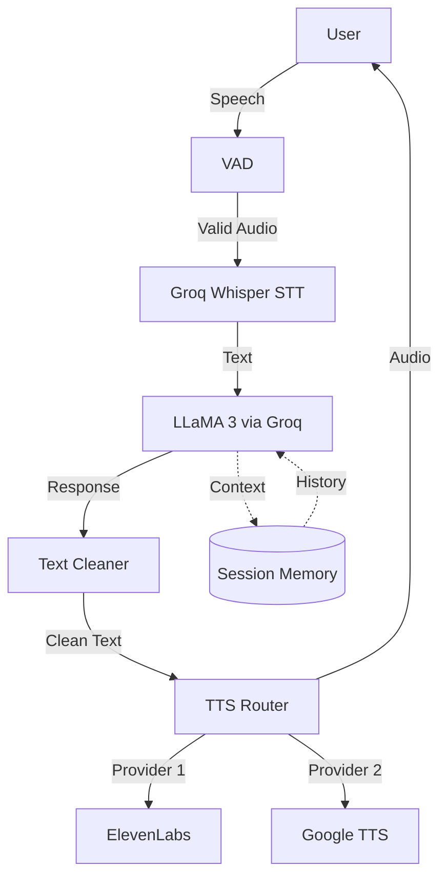

# 🎙️ AI Voice Assistant

A production-ready, multilingual voice assistant powered by LLaMA 3, Whisper, and advanced TTS engines. Features industry-standard Voice Activity Detection (VAD) and intelligent audio preprocessing for natural, human-like conversations.

[](https://www.docker.com/)
[](https://www.python.org/)
[](LICENSE)

## ✨ Key Innovations

### 1. Client-Side Voice Activity Detection (VAD)
- **RMS Energy Analysis**: Analyzes audio energy before sending to API
- **Speech Variation Detection**: Distinguishes actual speech from background noise
- **Cost Optimization**: Blocks silent/noise recordings, saving API costs
- **Universal Language Support**: Works in any language without blacklists

### 2. Intelligent Text Processing
- **TTS Markdown Cleaning**: Removes `*`, `#`, `` ` `` formatting before speech synthesis
- **Natural Audio Output**: Voice responses sound human, not robotic
- **Context-Aware Formatting**: Preserves rich formatting in chat while cleaning for audio

### 3. Multi-Provider TTS Architecture
- **Dual TTS Support**: ElevenLabs (premium) and Google TTS (fallback)
- **Voice Selection**: Multiple voice profiles (Rachel, Clyde, Mimi)
- **Hot-Swappable**: Easy to add new TTS providers

### 4. Session-Based Memory Management
- **Persistent Conversations**: Remembers context across interactions
- **Session Isolation**: Multiple users can have independent conversations
- **Docker-Compatible**: Uses file overwriting instead of deletion for container stability

## 🏗️ Architecture



### Stack
- **STT**: Groq-hosted Whisper Large v3
- **LLM**: LLaMA 3 (70B) via Groq
- **TTS**: ElevenLabs + Google Cloud Text-to-Speech
- **Backend**: Flask (Python 3.11+)
- **Frontend**: jQuery + Bootstrap 4
- **Containerization**: Docker + Docker Compose

## 🚀 Quick Start

### Prerequisites
- Docker Desktop (Windows/Mac) or Docker Engine (Linux)
- API Keys:
  - [Groq API Key](https://console.groq.com/) (for STT & LLM)
  - [ElevenLabs API Key](https://elevenlabs.io/) (optional)
  - [Google Cloud Service Account](https://cloud.google.com/text-to-speech) (optional)

### Installation

1. **Clone the repository**
   ```bash
   git clone https://github.com/onwurahben/voice-ai-bot.git
   cd voice-ai-bot
   ```

2. **Set up environment variables**
   ```bash
   cp .env.example .env
   ```
   
   Edit `.env` with your API keys:
   ```env
   GROQ_API_KEY=your_groq_key_here
   ELEVENLABS_API_KEY=your_elevenlabs_key_here
   ```

3. **Add Google Cloud credentials** (if using Google TTS)
   - Place your `google_key.json` in the project root

4. **Run with Docker**
   ```bash
   docker compose up
   ```

5. **Access the app**
   - Open http://localhost:7860 in your browser
   - Click the microphone and start talking!

## 💻 Local Development

### Without Docker

1. **Create virtual environment**
   ```bash
   python -m venv venv
   source venv/bin/activate  # On Windows: venv\Scripts\activate
   ```

2. **Install dependencies**
   ```bash
   pip install -r requirements.txt
   ```

3. **Run the server**
   ```bash
   python app/server.py
   ```

### Hot Reloading
Both Docker and local setups support hot-reloading. Code changes are reflected immediately without restarting.

## 📁 Project Structure

```
voice-assistant/
├── app/
│   ├── server.py          # Flask application & API routes
│   └── worker.py          # STT + LLM + TTS orchestration
├── stt/
│   └── whisper.py         # Groq Whisper integration
├── llm/
│   └── llama.py           # LLaMA 3 integration
├── tts/
│   ├── router.py          # TTS provider routing
│   ├── elevenlabs.py      # ElevenLabs TTS
│   └── google_tts.py      # Google Cloud TTS
├── utils/
│   ├── format_text.py     # Markdown cleaning for TTS
│   ├── memory.py          # Session-based conversation history
│   └── logger.py          # Centralized logging
├── static/
│   ├── script.js          # Frontend logic + VAD
│   └── style.css          # UI styling
├── templates/
│   └── index.html         # Web interface
├── Dockerfile             # Container configuration
├── docker-compose.yml     # Docker orchestration
└── .dockerignore          # Docker build exclusions
```

## 🎛️ Configuration

### TTS Voice Selection
Available voices:
- **Rachel**: Professional assistant voice
- **Clyde**: Narrator voice
- **Mimi**: Storyteller voice

Change via UI dropdown or modify `static/script.js`:
```javascript
voiceOptions.val('Rachel');
```

### VAD Sensitivity
Adjust thresholds in `static/script.js`:
```javascript
const hasSpeech = (rms > 0.02 && speechRatio > 0.05);
```
- Lower `rms` = more sensitive to quiet speech
- Lower `speechRatio` = accepts more uniform sounds

### Memory Settings
Configure conversation history depth in `app/worker.py`:
```python
messages = memory.get_messages_for_llm(session_id, max_messages=10)
```

## 🔒 Security Notes

- **Never commit** `.env`, `google_key.json`, or `chat_history.json`
- API keys are loaded from environment variables only
- Use `.gitignore` to exclude sensitive files
- For production: Use a reverse proxy (nginx) and enable HTTPS

## 🐛 Troubleshooting

### "No speech detected" on valid audio
- **Cause**: VAD thresholds too strict
- **Fix**: Lower `rms` threshold in `script.js` to `0.01`

### "Request timed out" errors
- **Cause**: Groq API rate limits or network issues
- **Fix**: Check Groq service status, ensure stable internet connection

### Browser not updating after code changes
- **Cause**: Browser cache
- **Fix**: Hard refresh (`Ctrl+Shift+R`) or increment version in `templates/index.html`:
  ```html
  <script src="../static/script.js?v=1.3"></script>
  ```

## 📊 Performance

- **Average STT Latency**: ~2-3 seconds (Groq Whisper)
- **Average LLM Response**: ~1-2 seconds (LLaMA 3 70B)
- **Average TTS Latency**: ~1-2 seconds (ElevenLabs) | ~3-5 seconds (Google)
- **Total Round-Trip**: ~5-8 seconds for complete interaction

## 🤝 Contributing

Contributions are welcome! Please:
1. Fork the repository
2. Create a feature branch (`git checkout -b feature/amazing-feature`)
3. Commit your changes (`git commit -m 'Add amazing feature'`)
4. Push to the branch (`git push origin feature/amazing-feature`)
5. Open a Pull Request

## 📝 License

This project is licensed under the MIT License - see the [LICENSE](LICENSE) file for details.

## 🙏 Acknowledgments

- [Groq](https://groq.com/) for ultra-fast LLM inference
- [ElevenLabs](https://elevenlabs.io/) for realistic TTS
- [Google Cloud](https://cloud.google.com/text-to-speech) for multilingual TTS
- [OpenAI](https://openai.com/) for Whisper architecture

## 📧 Contact

Ben Onwurah - [@onwurahben](https://github.com/onwurahben)

Project Link: [https://github.com/onwurahben/voice-ai-bot](https://github.com/onwurahben/voice-ai-bot)

---

**Built with ❤️ using Groq, LLaMA 3, and Whisper**